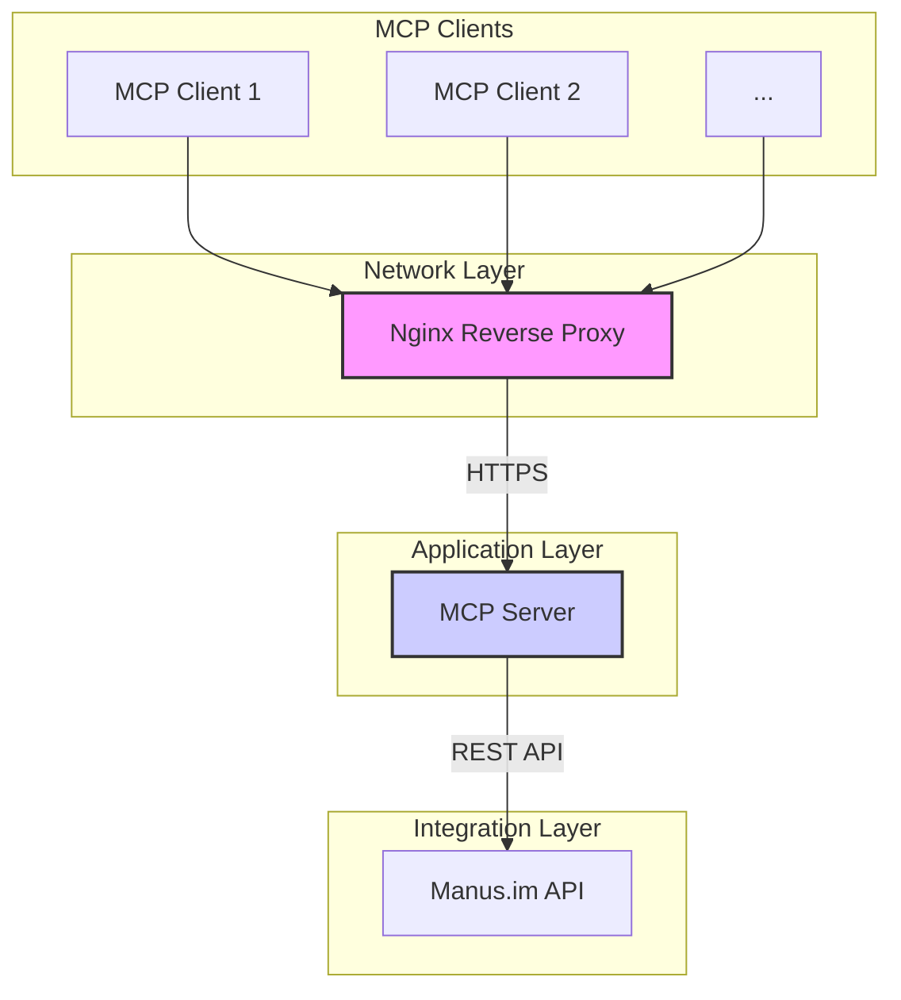

# MCP Manus Server

A production-ready Model Context Protocol (MCP) server with Manus.im integration, built following 2025 best practices for security, containerization, and scalability.

## 🚀 Features

- **MCP Compliance**: Implements the latest Model Context Protocol specification (2025-06-18)
- **Manus.im Integration**: Ready for Manus.im API integration with credit management and task execution
- **OAuth 2.1 Security**: Modern authentication with PKCE and resource indicators
- **Docker Security**: Multi-stage builds, non-root execution, and security hardening
- **TypeScript**: Full type safety with modern ES modules and Node.js 20+
- **Comprehensive Testing**: Unit, integration, and schema validation tests
- **Production Monitoring**: Structured logging, health checks, and audit trails

## 🏗️ Architecture

For a detailed explanation of the architecture, please see the [ARCHITECTURE.md](docs/ARCHITECTURE.md) file.



## 🛠️ Quick Start

### Prerequisites

- Node.js 20+
- Docker & Docker Compose
- Git

### Development Setup

1. **Clone and install dependencies:**

   ```bash
   git clone https://github.com/gianlucamazza/mcp-manus-server.git
   cd mcp-manus-server
   npm install
   ```

2. **Configure environment:**

   ```bash
   cp config/development.env .env
   # Edit .env with your configuration
   ```

3. **Start development server:**

   ```bash
   npm run dev
   ```

### Docker Deployment

1. **Build and run with Docker Compose:**

   ```bash
   docker-compose -f docker/docker-compose.yml up -d
   ```

2. **With HTTP proxy (optional):**

   ```bash
   docker-compose -f docker/docker-compose.yml --profile http up -d
   ```

3. **Health check:**

   ```bash
   curl http://localhost:8080/health
   ```

## 🔧 Configuration

### Environment Variables

| Variable              | Description                              | Required           |
| --------------------- | ---------------------------------------- | ------------------ |
| `OAUTH_CLIENT_ID`     | OAuth 2.1 client identifier              | ✅                  |
| `OAUTH_CLIENT_SECRET` | OAuth 2.1 client secret                  | ✅                  |
| `OAUTH_REDIRECT_URI`  | OAuth callback URL                       | ✅                  |
| `MANUS_API_KEY`       | Manus.im API key                         | 🔄 (when available) |
| `JWT_SECRET`          | JWT signing secret                       | ✅                  |
| `LOG_LEVEL`           | Logging level (debug, info, warn, error) | ❌                  |

### MCP Client Configuration

Add to your MCP client configuration:

```json
{
  "mcpServers": {
    "manus": {
      "command": "node",
      "args": ["path/to/mcp_manus/dist/index.js"],
      "env": {
        "OAUTH_CLIENT_ID": "your_client_id",
        "MANUS_API_KEY": "your_api_key"
      }
    }
  }
}
```

## 🔒 Security

This server implements comprehensive security measures following 2025 best practices. See [docs/SECURITY.md](docs/SECURITY.md) for detailed security documentation.

## 🛡️ Available Tools

| Tool                  | Description            | Input Schema        | Output Schema       |
| --------------------- | ---------------------- | ------------------- | ------------------- |
| `get_system_info`     | System information     | `{}`                | `{os: string, version: string}` |
| `echo`                | Echo input message     | `{message: string}` | `{response: string}`|
| `check_manus_credits` | Check Manus.im credits | `{}`                | `{credits: number}` |

## 📊 Available Resources

| Resource              | Description                 | Content Type       | Example Usage (CLI) |
| --------------------- | --------------------------- | ------------------ | ------------------- |
| `mcp://system/status` | System status and health    | `application/json` | `manus-mcp-cli resource get mcp://system/status` |
| `mcp://config/server` | Server configuration        | `application/json` | `manus-mcp-cli resource get mcp://config/server` |
| `mcp://manus/status`  | Manus.im integration status | `application/json` | `manus-mcp-cli resource get mcp://manus/status` |

## 🧪 Testing

```bash
# Run all tests
npm test

# Run tests with coverage
npm run test:coverage

# Run specific test suites
npm run test:unit
npm run test:integration

# Type checking
npm run typecheck

# Linting
npm run lint
```

## 📈 Monitoring & Observability

This project is configured with a complete monitoring stack based on Prometheus, Grafana, and Alertmanager. For more details, see the [monitoring/README.md](monitoring/README.md) file.

## 🚢 Deployment

See the [ARCHITECTURE.md](docs/ARCHITECTURE.md) for deployment and scaling considerations.

## 🤝 Contributing

Contributions are welcome! Please read our [CONTRIBUTING.md](CONTRIBUTING.md) to get started. Also, please read our [CODE_OF_CONDUCT.md](CODE_OF_CONDUCT.md) for our community standards.

## 📄 License

This project is licensed under the MIT License - see the [LICENSE](LICENSE) file for details.

## 🆘 Support

- **Issues**: [GitHub Issues](https://github.com/gianlucamazza/mcp-manus-server/issues)
- **Discussions**: [GitHub Discussions](https://github.com/gianlucamazza/mcp-manus-server/discussions)

