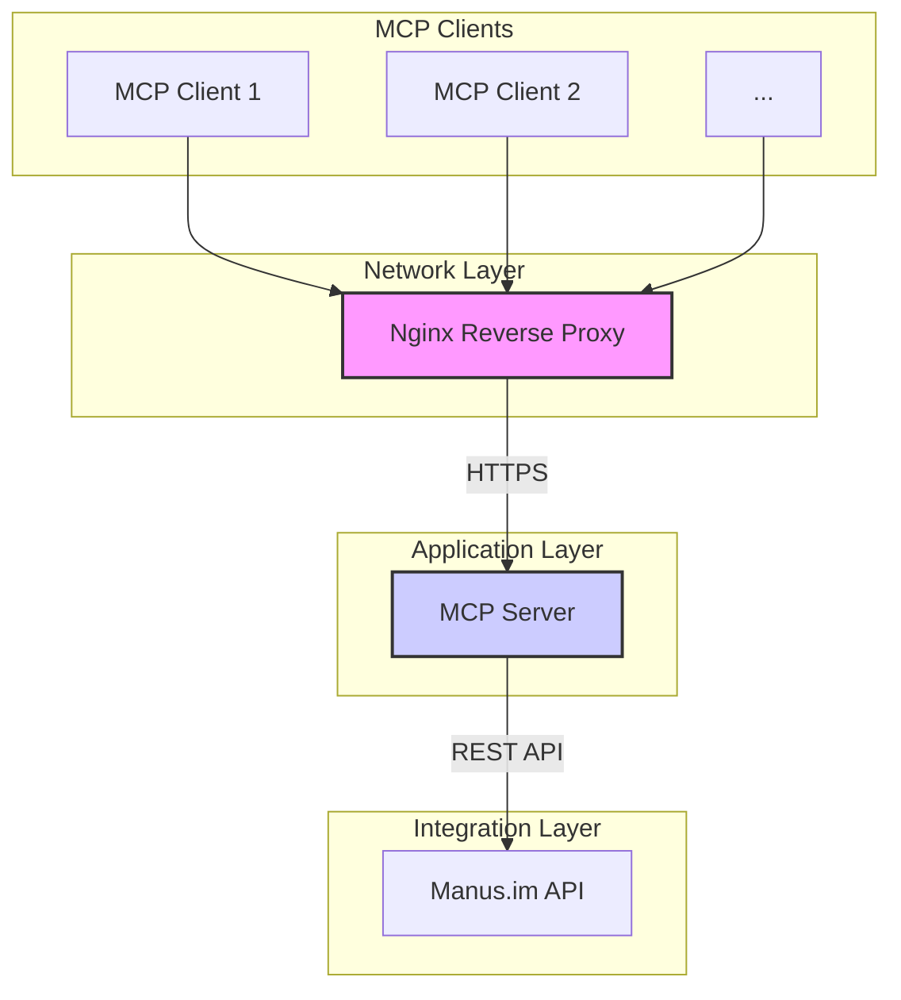

# Architecture

This document provides a detailed overview of the MCP Manus Server's architecture, components, and design principles.

## Core Principles

- **Modularity**: Components are designed to be independent and interchangeable.
- **Scalability**: The architecture supports horizontal scaling to handle increased load.
- **Security**: Security is a primary consideration at every layer of the stack.
- **Observability**: The system is designed to be easily monitored and debugged.

## Architecture Diagram



## Component Breakdown

### Nginx Reverse Proxy

- **Role**: Acts as the entry point for all incoming traffic.
- **Responsibilities**:
    - TLS Termination
    - Rate Limiting
    - Security Headers
    - Load Balancing (in a multi-node setup)
    - Static Content Caching

### MCP Server (Node.js/TypeScript)

- **Role**: The core application logic.
- **Components**:
    - **HTTP Server**: Handles incoming MCP requests.
    - **Authentication Manager**: Manages OAuth 2.1 flows, token validation, and session management.
    - **Tool Manager**: Discovers, registers, and executes available tools.
    - **Resource Manager**: Provides access to MCP resources.
    - **Manus.im Integration**: Communicates with the Manus.im API for task execution and credit management.
    - **Logging & Monitoring**: Provides structured logging and exposes metrics.

### Manus.im API

- **Role**: The external service for AI-powered task execution.
- **Functionality**:
    - Credit Management
    - Task Execution (text, code, etc.)
    - Real-time Status Updates

## Directory Structure

```
/mcp-manus-server
├── config/             # Environment configurations
├── docker/             # Docker-related files (Dockerfile, docker-compose.yml)
├── docs/               # Project documentation
├── src/                # Source code
│   ├── auth/           # Authentication and authorization logic
│   ├── integrations/   # Third-party API integrations (e.g., Manus.im)
│   ├── monitoring/     # Monitoring, logging, and metrics
│   ├── resources/      # MCP resource management
│   ├── server/         # HTTP server and routes
│   ├── tools/          # Tool management and execution
│   ├── types/          # TypeScript type definitions
│   └── utils/          # Utility functions
├── tests/              # Automated tests
└── ...                 # Other configuration files
```
